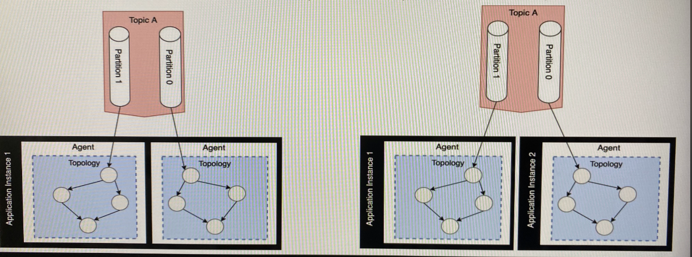

# Faust - discovery
## Key Data Constructs of Faust Library
### Stream
An abstraction over a kafka topic to describe constinuously flowing immutable sequence of events composing a detailed history of facts as key and value paired data structures (same underlying Kafka Topic storage layer).

### Table
An abstraction representing a snapshot of state contained in an underlying stream/topic over some period of time grouped and aggregated by common event keys.

Is a distributed data structure designed for aggregatin streams and represented as Python Dictionaries. tables are backed by a special changelog topic in Apache Kafka for fault-tolerance.

## Types of Streaming computations
### Stateless Transformations
Computation applied to each event in an event stream which do not require any knowledge of previously seen events
- Filter and Map

### Stateful Transformations
Computation that are applied to each event in an event stream but with information about previously seen events
- Joins, Reduce, Aggregate, Count...

## Keywords
### Agent:
Event processor responsible for performing computations whle iterating over an unbounded sequence fo event n a stream populated by a channel of events. Agents excute in application instances called **workers**

### Channels:
Abstraction representing a buffer through which messages are passed to be acted upon by an *agent*. Channels can be memory or backed by a transport storage tech like a Kafka Topic (the only one available now)

### Topic:
Named channel and is backed by a Kafka topic

### Stream:
An infinite async iterable backed by a channel or topic an operated on by an *Agent*

### Tasks:
Async process that executes on application worker startup. Tasks differ from agents, agents process streams of events continuosly whereas tasks execute as one off computations

### Timer:
Variation of a task in that it runs async pieces of code but on a specified periodic interval of seconds

## Producing & Processing
**Produce** by calling send(value=EventValue, key=EventKey) on a topic instance to publish events to a Topic

**Process** by iterating a stream sourced from a topic as part of an agent instance.

## Partitions Still Driving Parallelism
Kafka topic partition count dictates the horizontal scalability of Faust streams apps:
- Topologies execute in Agents
- Agents execute in Application Instances
- Application instances execute in parallel up to N number partition of source topic

